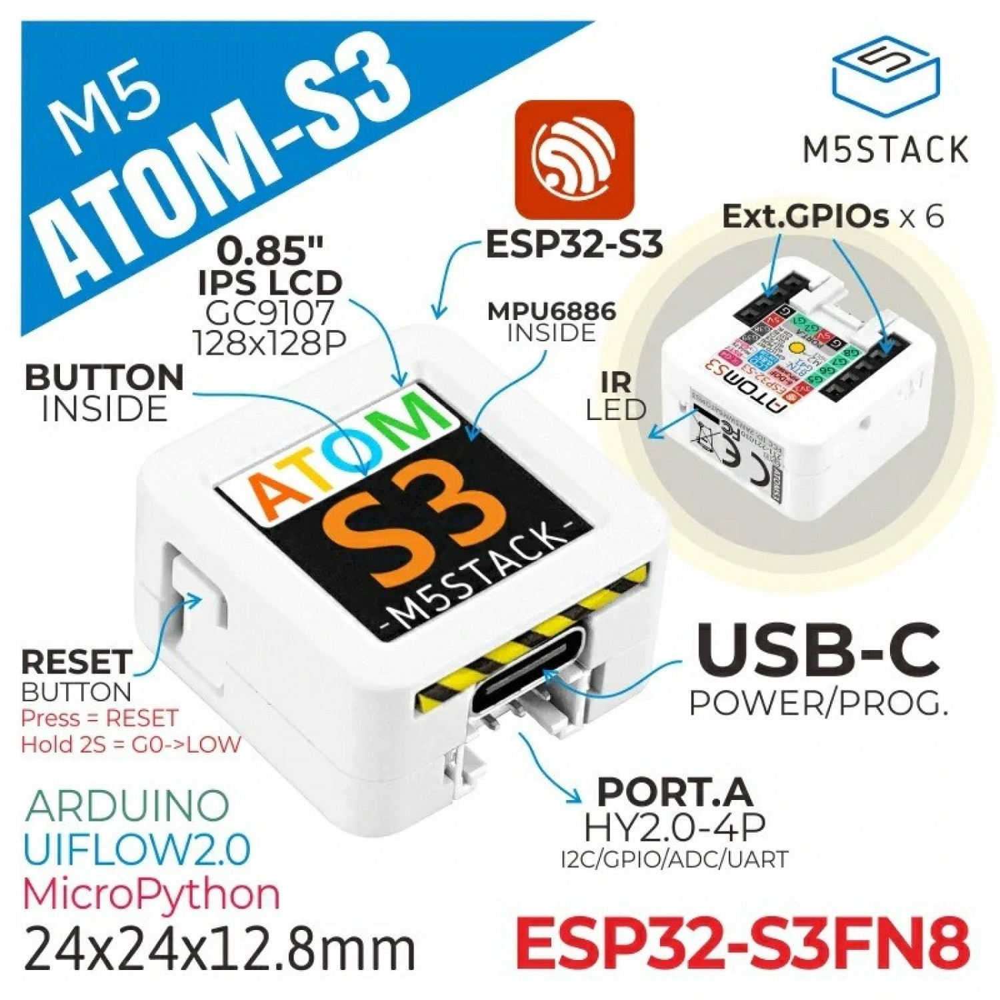

# My ESPHome Playground  

    Playground for ESPHome configs

## Actual device list

### [ESP32_CAM_MOD](esp32cam.yaml) 

### [M5 Atom S3](m5atom-s3.yaml) 

### [M5Stack M5GO](m5stack-core2.yaml) 

### [M5 Stick+](m5stick-plus.yaml) 

### [M5 Timer Camera](m5timer-cam.yaml)

